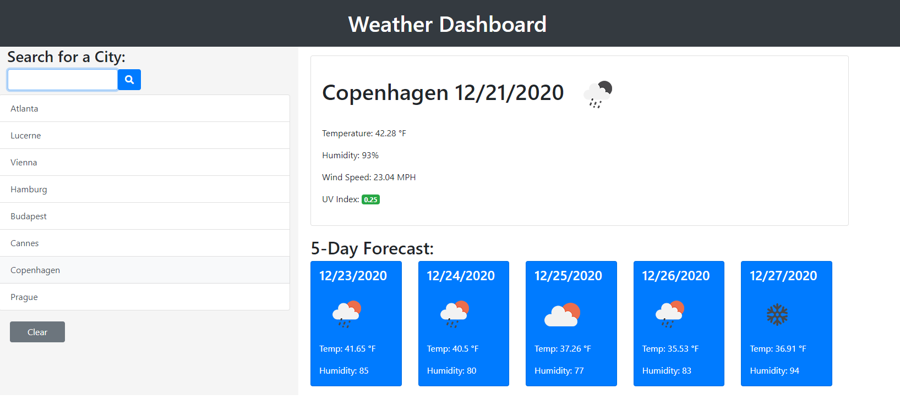

# The World Wide Weather Dashboard
## Description

This project asked us to build a site using ajax calls and our own API keys from <https://openweathermap.org/api>. The site would allow a user to search for a city and receive back the current weather data (showing temperature, humidity, wind speed and UV index) and a 5-day forecast (showing just temperature and humidity). All cities that were searched for would be added to a viewable history on the side of the page so that a user could quickly refer back to any previously searched cities. The javascript would also be built in such a way that if the user left the site and returned, their most recently searched for city would load first.

---------------------------

The deployed and functional site can be found here: <https://spencerv86.github.io/worldwide-weather-dashboard/?>

The full process can be found on my [Github](https://github.com/spencerv86/worldwide-weather-dashboard) repository linked here:
<https://github.com/spencerv86/worldwide-weather-dashboard>

----------------
## Table of Contents

* [Installation](#installation)
* [Usage](#usage)
* [Credits](#credits)
* [License](#license)

## Installation

To install and test the code, feel free to fork the repository [found here](https://github.com/spencerv86/worldwide-weather-dashboard), then clone to your computer and open in Visual Studio Code or your preferred interface. 

If you would simply like to view the finished and deployed site, you can also find it [here]()

## Usage

To use this site, simply input a city in the search bar and click the button next to it with the magnifying glass icon. The weather data and forecast related to the city you chose will quickly replace the default city's data and populate the page. You can continue to make as many searches as you'd like and if you'd like to refer back to previous cities, simply click the box with that city name within. 

If the list is starting to get too crowded, the Clear button will delete all searches and reset the page back to the default city. Your search results will be saved in your local storage, so your most recent search will load first should you leave and revisit the page, but your local storage will also be deleted if you press the Clear button so be careful! 

The default city is set as Atlanta so if this is your first time visiting or if you clear your results, Atlanta's weather will reload. 

## Credits

Thanks to my tutor Joem, the members of my cohort namely John and Pete for some helpful tips, and my instructional staff.

------------
## License

MIT License

Copyright (c) [2020] [Spencer Vaughan]

Permission is hereby granted, free of charge, to any person obtaining a copy
of this software and associated documentation files (the "Software"), to deal
in the Software without restriction, including without limitation the rights
to use, copy, modify, merge, publish, distribute, sublicense, and/or sell
copies of the Software, and to permit persons to whom the Software is
furnished to do so, subject to the following conditions:

The above copyright notice and this permission notice shall be included in all
copies or substantial portions of the Software.

THE SOFTWARE IS PROVIDED "AS IS", WITHOUT WARRANTY OF ANY KIND, EXPRESS OR
IMPLIED, INCLUDING BUT NOT LIMITED TO THE WARRANTIES OF MERCHANTABILITY,
FITNESS FOR A PARTICULAR PURPOSE AND NONINFRINGEMENT. IN NO EVENT SHALL THE
AUTHORS OR COPYRIGHT HOLDERS BE LIABLE FOR ANY CLAIM, DAMAGES OR OTHER
LIABILITY, WHETHER IN AN ACTION OF CONTRACT, TORT OR OTHERWISE, ARISING FROM,
OUT OF OR IN CONNECTION WITH THE SOFTWARE OR THE USE OR OTHER DEALINGS IN THE
SOFTWARE.

